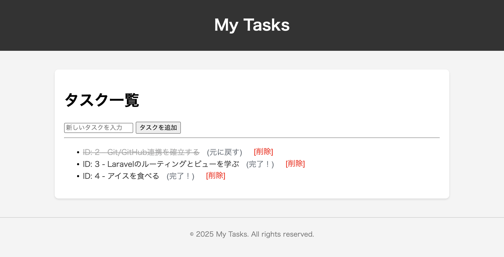

# Laravel CRUD 学習プロジェクト

このリポジトリは、Apple Silicon (M1/M2/M3) Mac 環境において、Laravel Sail (Docker) を使用して開発環境を構築し、タスク管理アプリ作成を題材に CRUD (Create, Read, Update, Delete) の基本操作を実装することを目的とした学習プロジェクトです。

# 開発環境の概要

フレームワーク: Laravel 10.x

実行環境: Laravel Sail (Docker Compose)

対応アーキテクチャ: Apple Silicon (ARM64) 最適化済み

使用サービス: Web/PHP, MySQL, Redis, Mailpit

# プロジェクトのセットアップと実行

プロジェクトを開始するために、以下の手順で Docker コンテナを起動します。

## 1. リポジトリのクローンと依存関係のインストール

### プロジェクトディレクトリに移動

cd my-laravel-app

### 依存関係をインストールし、Sail 環境を起動

Sail を起動します。

### (初回起動時は Docker イメージのビルドに時間がかかります)

docker compose up -d --build

## 2. 環境設定とデータベースマイグレーション

Docker コンテナが起動したら、sail コマンドで Artisan ツールを実行し、データベースを準備します。

### .env ファイルの設定

cp .env.example .env

### アプリケーションキーの生成

./vendor/bin/sail artisan key:generate

### データベースにテーブルを作成

./vendor/bin/sail artisan migrate

## 3. アプリケーションの実行

セットアップ完了後、以下の URL でタスク管理アプリケーションにアクセスできます。

http://localhost

# 主な学習機能 (CRUD 実装)

本プロジェクトでは、シンプルなタスク管理アプリを通じて、以下のコントローラ、ルーティング、モデルを使用した CRUD 操作を実装しました。

## 1. データ作成 (Create)

機能: フォームにタスク内容を入力し、データベース (tasks テーブル) に新しいレコードを挿入します。

ルーティング: POST /

コントローラ: GreetingController@storeTask

## 2. データ読み出し (Read)

機能: データベースに存在する全てのタスクを取得し、一覧として表示します。

ルーティング: GET /

コントローラ: GreetingController@showTasks

## 3. データ更新 (Update)

機能: タスクの状態 (完了/未完了) を切り替えます。ルートモデルバインディングを使用し、URL から受け取った ID に基づいてモデルを自動注入しています。

ルーティング: PATCH /task/{task}

コントローラ: GreetingController@updateTask

## 4. データ削除 (Delete)

機能: 特定のタスクをデータベースから完全に削除します。

ルーティング: DELETE /task/{task}

コントローラ: GreetingController@deleteTask
